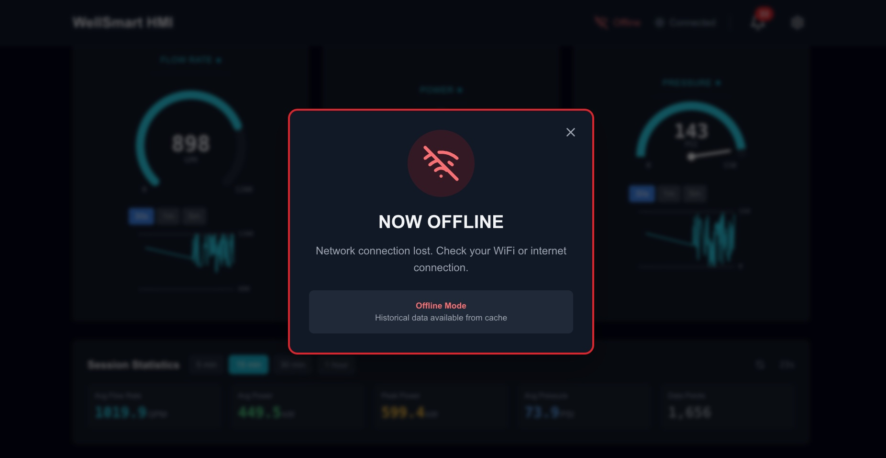
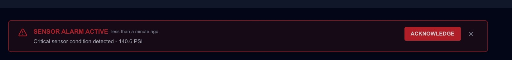
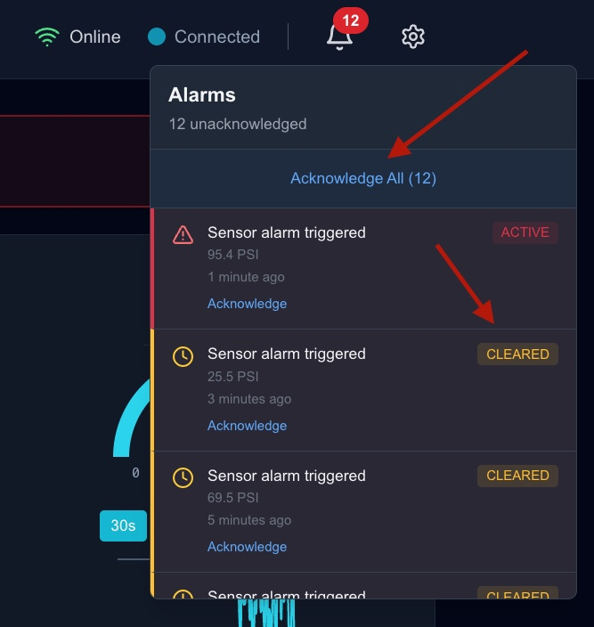
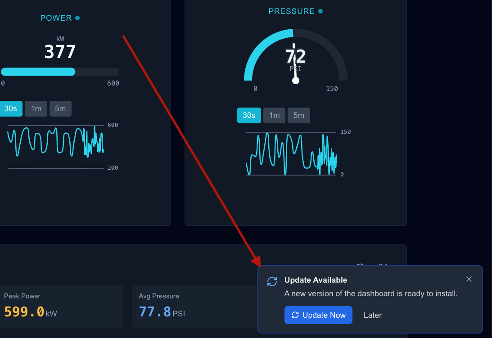

# WellSmart HMI Dashboard

Real-time industrial process monitoring with offline-first capabilities.

## Overview

HMI (Human-Machine Interface) dashboard for the WellSmart Technologies frontend challenge. Connects to a live WebSocket stream delivering process data at ~10ms intervals, with a dual-stream RxJS architecture that optimizes update rates for different UI elements. Features professional industrial aesthetics with dark/light theme support.

## Key Features

✅ **Real-time WebSocket** - RxJS reactive pipeline handling 100+ updates/second
✅ **Offline-First** - IndexedDB persistence + Service Worker caching  
✅ **Canvas Gauges** - High-performance visualizations (Flow, Power, Pressure)
✅ **Alarm System** - Real-time sensor alarm notifications
✅ **Professional UI** - Dark/Light theme HMI design (ISO 9241-110)
✅ **TypeScript** - Full type safety
✅ **Responsive** - Mobile-friendly design

## Technical Architecture

### Tech Stack

- **Next.js 14** (App Router) - Modern React framework
- **RxJS 7.8** - High-frequency WebSocket handling
- **Zustand 4.5** - Lightweight state management
- **Dexie.js** - IndexedDB wrapper (48-hour circular buffer)
- **ECharts 5.5** - Industrial-grade charting
- **Tailwind CSS** - Dark/Light theme styling with HMI design system

### Data Pipeline

```
WebSocket (10ms) → [RxJS: buffer, validate] → Dual Stream Architecture:

  ├─ UI Stream (100ms throttle)
  │   → [Zustand: currentData]
  │   → [React: Canvas gauges - 10fps updates]
  │
  └─ Storage Stream (200ms throttle)
      → [IndexedDB: Persistence]
      → [Zustand: historicalData]
      → [ECharts: Time-series visualization - 5fps updates]
```

### Architecture Choices Explained

**RxJS Dual-Stream Architecture**: Different UI elements need different update rates

- **Base stream**: `bufferTime(50)` + validation + `shareReplay()` for common processing
- **UI stream**: `throttle(100ms)` for smooth gauge animations (10fps)
- **Storage stream**: `throttle(200ms)` for IndexedDB writes and charts (5fps)
- **Why split?**: Gauges need frequent updates (100ms) to maintain a truly real-time, responsive feel with smooth animations, while storage/charts can use a slower 200ms rate without sacrificing functionality - persisting every 10ms from the WebSocket would waste resources
- **Benefits**: Single WebSocket connection, optimized update rates per use case, reduced IndexedDB write pressure
- Built-in reconnection with exponential backoff

**Canvas Over SVG**: SVG repaints entire DOM tree every frame

- Canvas is hardware-accelerated
- Sustains smooth 10fps gauge updates with 100+ messages/sec input
- Used in all industrial SCADA systems

**Zustand**: Minimal boilerplate, better TypeScript

- No actions/reducers needed
- Granular subscriptions (only affected components re-render)
- 1KB vs 3KB (Redux)

**Offline-First**: Critical for wellfield operations

- Service Worker caches app shell
- IndexedDB stores 48 hours of telemetry
- Automatic reconnection on network restore

## HMI Design Philosophy

### Design Principles

- **High Contrast**: Optimized contrast ratios for readability (WCAG AAA)
- **Status-First**: Color + icon redundancy (colorblind-accessible)
- **Professional**: Industrial standard aesthetic
- **Ergonomic**: Optimized for 24/7 monitoring
- **Responsive**: Mobile-friendly layouts with Tailwind breakpoints

### Color System

**Accent Color (Both Themes)**:

```
Primary: Cyan (#22d3ee dark / #06b6d4 light)
- Used for gauges, charts, active states
- High visibility, modern HMI look
```

**Status Colors**:

```
✅ OK: Green (#22c55e)
⚠️ Warning: Amber (#fbbf24)
❌ Error: Red (#ef4444)
ℹ️ Info: Blue (#3b82f6)
```

## Performance: 100 Updates/Second

**Challenge**: WebSocket sends ~10ms intervals (100+ messages/sec), but UI and storage have different needs

**Solutions**:

1. **RxJS Dual-Stream Architecture**

   ```typescript
   // Base stream - shared processing
   baseStream$ = ws$.pipe(bufferTime(50), filter / validate, shareReplay());

   // UI stream - 10fps for smooth gauges
   dataStream$ = baseStream$.pipe(
     throttle(() => timer(100)),
     scan()
   );

   // Storage stream - 5fps for persistence/charts
   storageStream$ = baseStream$.pipe(
     throttle(() => timer(200)),
     tap((data) => db.add(data)),
     scan()
   );
   ```

   - Base stream handles common validation once
   - UI stream updates gauges at 10fps (100ms) for smooth animation
   - Storage stream writes to IndexedDB at 5fps (200ms) to reduce I/O pressure
   - Single WebSocket, multiple consumers via `shareReplay()`
   - Prevents memory buildup and excessive persistence writes

2. **Canvas Rendering**

   - Single GPU operation per frame
   - No DOM updates needed
   - 10x faster than SVG

3. **Chart Optimization**
   - Time-window based filtering (30s/1m/5m)
   - Charts anchor to most recent data point (no clock drift)
   - ECharts native rendering with smooth curves
   - No animation to prevent visual "dancing"

**Results**:

- ✅ Smooth 10fps gauge updates
- ✅ 5fps storage writes (reduces IndexedDB pressure)
- ✅ ~12 minutes of in-memory data (3600 points at 200ms)
- ✅ <100ms latency
- ✅ <2s Time to Interactive
- ✅ <500KB bundle (492 KB first load JS)

## Running Locally

```bash
# 1. Install dependencies
npm install

# 2. Create .env.local file and add your WebSocket URL
cp .env.local.example .env.local
# Edit .env.local and replace YOUR_WEBSOCKET_URL with your actual WebSocket URL
# NEXT_PUBLIC_WS_URL="wss://your-websocket-server.com/ws"

# 3. Start development server
npm run dev

# 4. Open http://localhost:3000
```

**Note**: The application requires a WebSocket URL to connect to the data stream. If `NEXT_PUBLIC_WS_URL` is not configured, the app will display a disconnected state but remain functional for testing the UI.

## Theme Support

The application supports both dark and light themes with dark mode as the default:

**Dark Theme (Default)**:

- Reduces eye strain for 24/7 monitoring
- Modern HMI aesthetic
- Better for low-light control rooms
- Prevents FOUC (Flash of Unstyled Content) on load

**Light Theme (Optional)**:

- Better readability in well-lit environments
- Higher contrast (WCAG AAA)
- Professional appearance for client-facing displays
- Follows ISO 9241-110 ergonomics

Theme persists across sessions and can be toggled via the settings modal.

## Browser Support

- Chrome/Edge 90+
- Firefox 88+
- Safari 14+
- Requires WebSocket + IndexedDB

## Key Insights

1. **Dual-Stream Architecture**: Different UI elements need different update rates - gauges benefit from 10fps smoothness while 5fps storage writes reduce IndexedDB pressure
2. **RxJS Operator Composition**: Single base stream with multiple consumers via `shareReplay()` eliminates redundant processing
3. **Canvas Critical**: Hardware-accelerated rendering handles high-frequency updates without DOM thrashing
4. **Chart Time Anchoring**: Anchoring visible time windows to the most recent data point (not clock time) prevents visual "erasing"
5. **Zustand Wins**: State management with 90% less boilerplate than Redux
6. **Offline-First**: IndexedDB persistence enables historical queries and session statistics
7. **Type Safety**: Strict typing prevents WebSocket/persistence bugs

---

## Features Showcase

### Offline Mode


_Application continues working when internet connection is lost, with automatic reconnection._

The app handles two types of disconnection scenarios:

1. **Network Offline** (WiFi/Internet lost): Shows "NOW OFFLINE" modal with WiFi icon
2. **Server Disconnected** (WebSocket lost): Shows "DISCONNECTED FROM SERVER" modal with server icon

**What makes offline mode work:**

1. **IndexedDB Persistence**: All WebSocket data is stored locally in IndexedDB at 5fps (200ms intervals). Historical data from the current session remains available for viewing and analysis even when disconnected.

2. **Service Worker Caching**: The service worker caches the app shell (HTML, JS, CSS, images) using multiple strategies:

   - **Network-first** for HTML (app updates immediately when online)
   - **Stale-while-revalidate** for JS/CSS (instant load with background updates)
   - **Cache-first** for fonts and images (optimal performance)

3. **Automatic Reconnection**: RxJS WebSocket stream includes exponential backoff retry logic that automatically attempts to reconnect when the connection is restored.

**During offline mode:**

- Gauges freeze at last known values
- Charts display all cached historical data (up to 48 hours in IndexedDB)
- Session statistics continue to query IndexedDB
- App shell loads instantly from cache

### Real-time Alarms


_Sensor alarms trigger immediate notifications with pressure threshold details._

**Alarm Banner Behavior:**

The alarm banner appears instantly when the WebSocket stream reports `sensor_alarm: true` and displays the current pressure reading. The banner persists until:

- The alarm condition clears (WebSocket returns `sensor_alarm: false`), OR
- The user acknowledges or dismisses the alert


_Complete alarm history from the current session, accessible via the notification icon dropdown._

**Alarm Status Definitions:**

- **🔴 Active**: Alarm is currently triggered in the WebSocket stream and has not been acknowledged by the user. Requires attention.

- **🟡 Acknowledged**: User has acknowledged the alarm, but the alarm condition is still active in the WebSocket stream. Monitoring in progress.

- **⚪ Cleared**: Alarm condition has automatically resolved (no longer active in WebSocket stream), but user has not yet acknowledged it. Informational.

- **✅ Resolved**: Alarm has both cleared automatically AND been acknowledged by the user. Complete lifecycle closure.

**Key Features:**

- All alarms from the current session are persisted and viewable
- Status updates happen automatically as WebSocket data changes
- User acknowledgment is tracked independently from alarm state
- Provides full audit trail of alarm events for the session

### Software Updates


_Service worker notifies users when new version is available._

**How automatic updates work:**

1. **Update Detection**: The service worker automatically checks for updates every 60 seconds by comparing the hash of `/sw.js` with the cached version.

2. **Background Installation**: When a new version is detected, the updated service worker installs in the background without interrupting the current session.

3. **User Notification**: Once the new service worker is installed and enters "waiting" state, an update notification appears offering the user the choice to update now or later.

4. **Activation Process**: When the user clicks "Update Now":
   - The app sends a `SKIP_WAITING` message to the waiting service worker
   - The new service worker activates immediately
   - The page automatically reloads with the new cached assets
   - Users now have the latest version with all new features and bug fixes

**Benefits:**

- Zero-downtime updates - new version installs while app is running
- User control - updates only apply when user confirms (not forced)
- Offline availability - updated assets are immediately cached for offline use
- Automatic checking - no manual intervention needed to discover updates

This ensures users always have access to the latest features while maintaining a smooth, uninterrupted experience.
